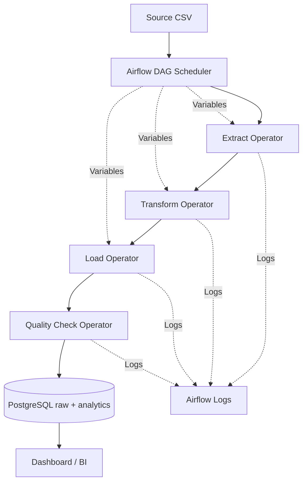

# Airflow ETL Architecture

## Components
- Scheduling: Daily DAG schedule at 02:00
- Operators: PythonOperator for ETL + BashOperator for run logs
- Variables: Runtime source and database configuration
- Logging: Task-level logs in Airflow task logs
- Retries: Default retries on ETL/quality tasks
- Storage: Postgres schemas `raw` and `analytics`
